<h1 align="center">좋아하면 누르는</h1>

<h1 align="center" style="max-width: 100%;">
  <br/>
</h1>

<table>
  <tbody>
    <tr>
      <td></td>
      <td></td?>
    </tr>
    <tr>
      <td></td>
      <td></td>
    </tr>
  </tbody>
</table>


<br>

<p align="center">
  <b>Supported</b><br/>
  <a href="#"></a>&nbsp;&nbsp;
    <a href="#"></a>&nbsp;&nbsp;
  <a href="#"></a>&nbsp;&nbsp;
  <a href="#"></a>&nbsp;&nbsp;
  <a href="#"></a>&nbsp;&nbsp;
    <a href="#"></a>&nbsp;&nbsp;
    <a href="#"></a>&nbsp;&nbsp;
    <a href="#"></a>&nbsp;&nbsp;
    <a href="#"></a>&nbsp;&nbsp;
  <a href="#"></a>&nbsp;&nbsp;
    <a href="#">

<br>


## 🌈 개요

### 다운로드 및 실행

웹 : www.someone-might-like-you.com

안드로이드 : https://play.google.com/store/apps/details?id=com.cupid.joalarm

아이폰 : https://play.google.com/store/apps/details?id=com.nianticlabs.pokemongo

<br>

<table style="table-layout: fixed; overflow-wrap: break-word;">
  <tbody>
    <tr>
      <td colspan="2"><a href="#" target="_blank"></a></td>
    </tr>
  </tbody>
</table>
<h1 align="center" >
   익명 속에서 설렘을
</h1>
<h3 align="center">
  <br>
  주변 100m 이내의 사용자들은 서로의 위치를 공유합니다. <br><br>
  하트를 송수신 할 수 있으며, 하트가 매칭된 사용자들은 1:1 채팅이 자동으로 생성합니다. <br><br>
  이모지 변경, 유저 신고 등 부가적인 기능을 제공합니다.
</h3>

<br>

## 🫧 Release History

<h3 align="center">
  22.05.21 - 앱스토어 출시</h3>

<h3 align="center">
  22.05.20 - 플레이스토어 출시</h3>

<h3 align="center">
  22.05.13 - Web 2차 배포</h3>  <h5  align="center">안내 템플릿 <br> 건의함 <br> 위치 엑세스 허용 안내 <br> 이모지 변경 <br></h5>
<h3 align="center">
  22.05.06 - Web MVP 최초 배포</h3>
 <h5  align="center"> 사용자간 위치 공유 <br> 하트 송수신 <br> 채팅 <br> 유저 신고 <br></h5>

<br>

## 🛠 기술 스택

### **Front-end**

|  |  |  |
| :----------------------------------------------------------------------------------------------------------------------------: | :--------------------------------------------------------------------------------------------------------------------------: | :-----------------------------------------------------------------------------------------------------------------------------: |
|                                                             HTML5                                                              |                                                             CSS3                                                             |                                                           javascript                                                            |

|  |  |  |
| :-------------------------------------------------------------------------------------------------------------------------------: | :-------------------------------------------------------------------------------------: | :-------------------------------------------------------------------------------------------------------------------------------------------: |
|                                                               React                                                               |                                          Stomp                                          |                                                                  TypeScript                                                                   |

### **Back-end**

|  |  |  |  |  |
| :--------------------------------------------------------------------------------------------------------------------------: | :---------------------------------------------------------------------------------------------------------------------------------------------: | :-----------------------------------------------------------------------------------------------------------------------------------: | :---------------------------------------------------------------------------------------------------------------------------------------------------: | :--------------------------------------------------------------------------------: |
|                                                             Java                                                             |                                                                   Spring-Boot                                                                   |                                                              Spring-JPA                                                               |                                                                    Spring-Security                                                                    |                                        JWT                                         |

### DB

|  |  |
| :----------------------------------------------------------------------------------------------------------------------------: | :--------------------------------------------------------------------------------------------------------------------------------------------------------------------------------------------: |
|                                                             MySQL                                                              |                                                                                            Mongodb                                                                                             |

### **DevOps**

|  |  |  |  |  |
| :-------------------------------------------------------------------------------------------------------------------: | :------------------------------------------------------------------------------------------------------------------------------: | :------------------------------------------------------------------------------------------------------------------------------: | :------------------------------------------------------------------------------------------------------------: | :-----------------------------------------------------------------------------------------------------------------------------------------------------------------------------------------------------: |
|                                                         NGiNX                                                         |                                                               aws                                                                |                                                              docker                                                              |                                                    Jenkins                                                     |                                                                                               Kubernetes                                                                                                |

### 기획 및 운영

|  |  |  |  |  |  |
| :-------------------------------------------------------------------------------------------------------------------------------------------------------------: | :------------------------------------------------------------------------------------------------------------------------------------------------------------------------------------------: | :---------------------------------------------------------------------------------------------------------------: | :---------------------------------------------------------------------------------------------------------------------------------: | :-----------------------------------------------------------------------------------------------------------------------------------------------------------------: | :------------------------------------------------------------------------------------------------------------------------------------------------------------------: |
|                                                                               Git                                                                               |                                                                                             JIRA                                                                                             |                                                       Figma                                                       |                                                               Notion                                                                |                                                                             Mattermost                                                                              |                                                                               Discord                                                                                |

### App

|  |  |  |  |
| :--------------------------------------------------------------------------------------------------------------------------------------------------------: | :------------------------------------------------------------------------------------------------------------------------------------------: | :----------------------------------------------------------------------------------------------------------------------------------------------------: | :---------------------------------------------------------------------------------------------------------------------------------------------------------------------------------------------: |
|                                                                           Kotlin                                                                           |                                                                Android Studio                                                                |                                                                         Swift                                                                          |                                                                                              Xcode                                                                                              |

<br>

## 💞 Team & Stack

<table>
<tr>
  <td valign="top" width="50%">
    <a href="https://github.com/eora21">
      
    </a>
  </td>
  <td valign="top" width="50%">
    <a href="https://github.com/glowforever42">
      
    </a>
  </td>
</tr>
<tr>
  <td valign="top" width="50%">
    <a href="https://github.com/82surf">
      
    </a>
  </td>
  <td valign="top" width="50%">
    <a href="https://github.com/Gkuer">
      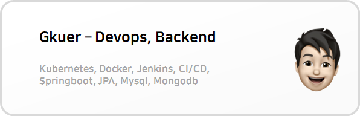
    </a>
  </td>
  </tr>
  <tr>
    <td valign="top" width="50%">
    <a href="https://github.com/EuneeChung">
      
    </a>
  </td>
  <td valign="top" width="50%">
    <a href="https://github.com/gkstmdgns422">
      
    </a>
  </td>
</tr>
</table>

|       Content       |            Main             |                     Detail                     |
| :-----------------: | :-------------------------: | :--------------------------------------------: |
|   **kubernetes**    |         Kubernetes          |               Kubernetes 1.14.0                |
| **파이프라인 구축** |           Jenkins           |                Jenkins Pipeline                |
|      **CI/CD**      | Docker, Jenkins, Kubernetes | Docker, Jenkins, Dockerhub, Kubernetes Rollout |
|  **Ingress Nginx**  |  Kubernetes Ingress-nginx   | Nginx, Let's encrypt, Kubernetes Ingress-nginx |
|      **배포**       |             AWS             |          EC2(Ubuntu Server 20.04 LTS)          |

<br>

# ⚙️ 쿠버네티스, 도커, 젠킨스를 활용한 배포와 CI/CD에 대하여

### `개요`

> 높은 트래픽과 소켓 통신으로 인한 부하를 예상했다. 해당 트래픽과 부하를 Devops가 나 혼자인 우리 팀이 감당하기 위해 쿠버네티스를 도입했다.

> 쿠버네티스 설계부터 CI/CD 적용까지, 처음이라 어려웠고, 자동화까지 완성했을 때는 그만큼 보람을 느꼈다.


#### 쿠버네티스 도입 목적

*  무중단 배포

*  부하분산

*  오토힐링

*  컨테이너의 관리


#### 클러스터 설계


* EC2 서버 4개를 가용자원으로, 마스터 노드 1개와 워커 노드 3개로 구성한다.

* Mysql, Mongodb로 DB 이원화를 적용한다. (채팅의 Read속도 고려)

* 해당 DB는 PVC-PV 마운트하여 영구적으로 보관한다.

* Desired State : 백엔드는 팟 10개 / 프론트엔드는  팟 7개로 설정하였다.

* EC2서버 4개가 가용자원으로, 마스터 노드 1개와 워커 노드 3개로 구성한다.

* Mysql, Mongodb로 DB 이원화를 적용한다. (채팅의 Read속도 고려)

* 해당 DB는 PVC-PV 마운트하여 영구적으로 보관한다.

* Desired State : 백엔드는 팟 10개 / 프론트엔드는 팟 7개로 설정하였다.

* Ingress-nginx를 적용하였고, Let's Encrypt를 통해 HTTPS를 적용하였다.

* Jenkins Pipeline을 구축하여, 일련의 과정을 자동화한다.

  - Git의 변화를 감지하여 Code를 받아오고,

  - 해당 코드로 Docker Image를 생성한다.

  - 생성된 Docker Image를 Dockerhub에 Push한다.

  - Kube와 연동하여 해당 Deployment를 Rollout한다.

* Mattermost와 연동하여 빌드 현황과 로그를 공유한다.

<br>

## 🪐 구현

## 1. Master node & Worker node 설치 및 연결

- [개발 레퍼런스](https://www.notion.so/f1250dbff0914f64a63ba3009d1e93ba)

## 2. Mysql

### 컨테이너 이동

- Gkuer’s Mac ⇒ Ubuntu Server (Docker Image Commit)

  - 로컬에서 돌고 있던 Docker Process

  ```bash
  ~ » docker ps -a                                                                                                
  CONTAINER ID   IMAGE               COMMAND                  CREATED       STATUS        PORTS                               NAMES
  9cf192c49625   jenkins/joalarm     "java -jar /app.jar"     4 hours ago   Up 4 hours    0.0.0.0:8888->8888/tcp              jenkins-joalarm
  069395ce7cc1   mongo               "docker-entrypoint.s…"   5 days ago    Up 13 hours   0.0.0.0:27017->27017/tcp            mongodb
  b51d9e9b3678   jenkins/myjenkins   "/sbin/tini -- /usr/…"   6 days ago    Up 13 hours   0.0.0.0:8080->8080/tcp, 50000/tcp   jenkins
  1ba9da064b77   mysql               "docker-entrypoint.s…"   6 days ago    Up 13 hours   0.0.0.0:3306->3306/tcp, 33060/tcp   cupid
  ```

  - Mysql Commit

  ```bash
  ~ » docker commit 1ba9da064b77 joalarm-mysql                                                                 
  sha256:7f4888b6400c74a46db1a9d9518033ffc6315fb3933a8e905c99d011a18815ae
  ```

  - Tag 달기

  ```bash
  ~ » docker tag joalarm-mysql $docker_id_user/joalarm-mysql
  ```

  - Dockerhub Push

  ```bash
  ~ » docker push $docker_id_user/joalarm-mysql                                                               
  Using default tag: latest
  The push refers to repository [docker.io/gkuer/joalarm-mysql]
  6b4a66619f38: Pushed
  20048e9ea24b: Mounted from library/mysql
  f654c732eb30: Mounted from library/mysql
  d89c67210fbb: Mounted from library/mysql
  999500c33f79: Mounted from library/mysql
  e19e05fc6c0c: Mounted from library/mysql
  f1ce24a3a906: Mounted from library/mysql
  bcdcddd1968e: Mounted from library/mysql
  a6139270daa5: Mounted from library/mysql
  f8589c04a7c4: Mounted from library/mysql
  726b89cb4adb: Mounted from library/mysql
  83798bb64452: Mounted from library/mysql
  c1065d45b872: Mounted from library/mysql
  latest: digest: sha256:f0172f2a9f054230231b349208f6de009efb0ad9e68983c3d90a138b46a00b41 size: 3035
  ```

  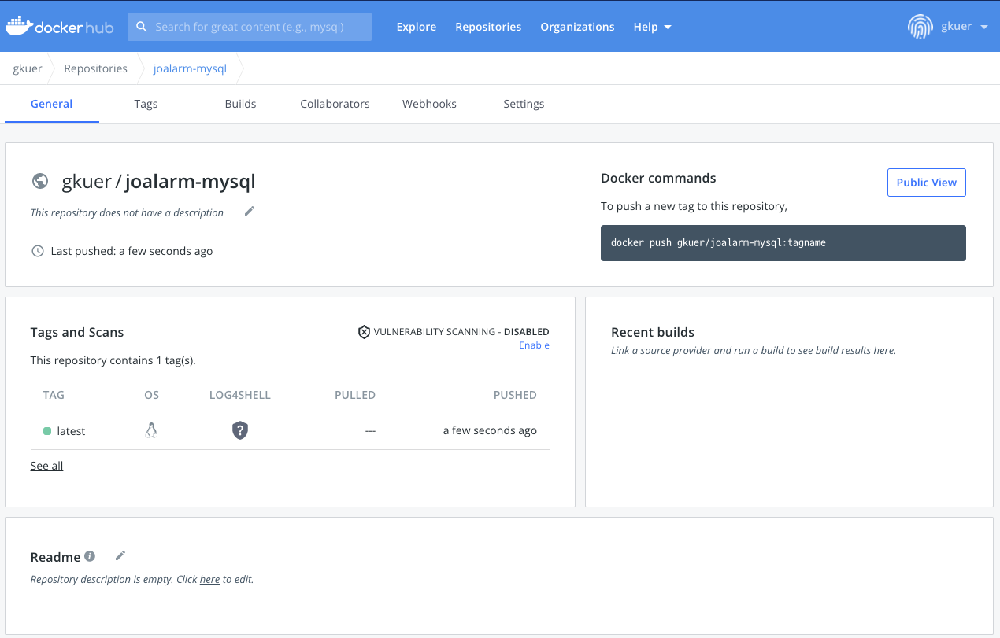

### PV

- PV/PVC 적용 이유

  - emptydir로 구성할 경우 pod이 사라질 때, 함께 사라져 문제가 있음
  - hostpath로 구성할 경우 pod의 node 위치가 변하면, 문제가 되기 때문에 실무에서 쓰기에는 제약사항이 큼
  - 따라서, pod과 node에 상관없이 중요도 있는 자원인 DB를 영구 저장하기 위해 PV/PVC 사용

- PV 생성할 노드에 작업폴더 설정

  ```bash
  $ sudo mkdir -p /workspace/kubernetes/mysql
  $ sudo chown -R truelifer:truelifer /workspace/kubernetes
  $ cd /workspace/kubernetes/mysql
  ```

- StorageClass 생성

  ```bash
  kind: StorageClass
  apiVersion: storage.k8s.io/v1
  metadata:
    name: local-storage-mysql
  provisioner: kubernetes.io/no-provisioner
  volumeBindingMode: WaitForFirstConsumer
  ```

- PV 생성할 노드에 저장될 폴더 및 권한 부여

  ```bash
  $ sudo mkdir -p /workspace/data/kubernetes/pv/mysql
  $ sudo chmod 777 /workspace/data/kubernetes/pv/mysql
  ```

- PV 생성

  ```bash
  apiVersion: v1
  kind: PersistentVolume
  metadata:
    name: pv-mysql
  spec:
    capacity:
      storage: 10Gi
    accessModes:
    - ReadWriteOnce
    persistentVolumeReclaimPolicy: Retain
    storageClassName: local-storage-mysql
    local:
      path: /workspace/data/kubernetes/pv/mysql
    nodeAffinity:
      required:
        nodeSelectorTerms:
        - matchExpressions:
          - key: kubernetes.io/hostname
            operator: In
            values:
            - ip-172-26-7-13
  ```

### PVC

- PVC 생성

  ```bash
  kind: PersistentVolumeClaim
  apiVersion: v1
  metadata:
    name: pvc-mysql
  spec:
    accessModes:
    - ReadWriteOnce
    storageClassName: local-storage-mysql
    resources:
      requests:
        storage: 10Gi
  ```

### Deployment

- Deployment 생성

  ```bash
  apiVersion: apps/v1
  kind: Deployment
  metadata:
    name: mysql
  spec:
    selector:
      matchLabels:
        app: mysql
    strategy:
      type: Recreate
    template:
      metadata:
        labels:
          app: mysql
      spec:
        containers:
        - image: gkuer/joalarm-mysql
          name: mysql
          ports:
          - containerPort: 3306
            name: mysql
          volumeMounts:
          - name: volume-mysql
            mountPath: /var/lib/mysql
        volumes:
        - name: volume-mysql
          persistentVolumeClaim:
            claimName: pvc-mysql
  ```

### Service

- Service 생성

  ```bash
  apiVersion: v1
  kind: Service
  metadata:
    name: service-mysql
  spec:
    type: NodePort
    selector:
      app: mysql
    ports:
      - protocol: TCP
        port: 3306
        nodePort: 30000
        targetPort: 3306
  ```

## 3. Mongodb

### 컨테이너 이동

- Gkuer’s Mac ⇒ Ubuntu Server (Docker Image Commit)

  - 로컬에서 돌고 있던 Docker Process

  ```bash
  ~ » docker ps -a                                                                                             
  CONTAINER ID   IMAGE               COMMAND                  CREATED       STATUS        PORTS                               NAMES
  9cf192c49625   jenkins/joalarm     "java -jar /app.jar"     4 hours ago   Up 4 hours    0.0.0.0:8888->8888/tcp              jenkins-joalarm
  069395ce7cc1   mongo               "docker-entrypoint.s…"   5 days ago    Up 13 hours   0.0.0.0:27017->27017/tcp            mongodb
  b51d9e9b3678   jenkins/myjenkins   "/sbin/tini -- /usr/…"   6 days ago    Up 13 hours   0.0.0.0:8080->8080/tcp, 50000/tcp   jenkins
  1ba9da064b77   mysql               "docker-entrypoint.s…"   6 days ago    Up 13 hours   0.0.0.0:3306->3306/tcp, 33060/tcp   cupid
  ```

  - Mongodb Commit

  ```bash
  ~ » docker commit 069395ce7cc1 joalarm-mongo
  sha256:7cd16756e8977048e785ce1501ee828f9297588437aa62d5763600c1931445ee
  ```

  - Tag 달기

  ```bash
  ~ » docker tag joalarm-mongo $docker_id_user/joalarm-mongo
  ```

  - Dockerhub Push

  ```bash
  ~ » docker push $docker_id_user/joalarm-mongo                                                                                      
  Using default tag: latest
  The push refers to repository [docker.io/gkuer/joalarm-mongo]
  80499f2d5cc7: Pushed
  df4fb866be24: Pushed
  2589885a8bde: Pushed
  ae384ea51b6b: Pushed
  5edfa274a10d: Pushed
  2b3691b33f48: Pushed
  36be1891c787: Pushed
  af26174c4942: Pushed
  5eb80b566e76: Pushed
  579eea2a4698: Pushed
  c5ec52c98b31: Pushed
  latest: digest: sha256:af931c846a19e30ba3b43f9d39a4eb6557e860a77f79f97a4c3dd3162604bdbf size: 2616
  ```

  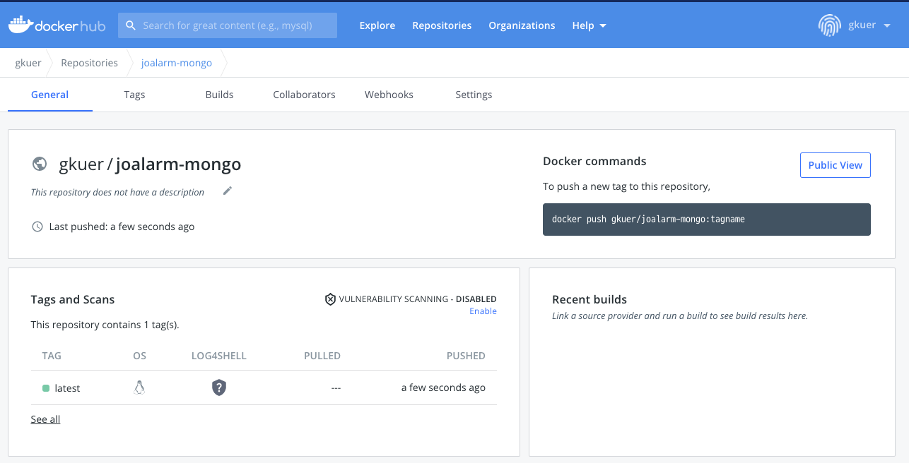

### PV

- PV 생성할 노드에 작업폴더 설정

  ```bash
  $ sudo mkdir -p /workspace/kubernetes/mongo
  $ sudo chown -R truelifer:truelifer /workspace/kubernetes
  $ cd /workspace/kubernetes/mongo
  ```

- StorageClass 생성

  ```yaml
  kind: StorageClass
  apiVersion: storage.k8s.io/v1
  metadata:
    name: local-storage-mongo
  provisioner: kubernetes.io/no-provisioner
  volumeBindingMode: WaitForFirstConsumer
  ```

- PV 생성할 노드에 저장될 폴더 및 권한 부여

  ```bash
  $ sudo mkdir -p /workspace/data/kubernetes/pv/mongo
  $ sudo chmod 777 /workspace/data/kubernetes/pv/mongo
  ```

- PV 생성

  ```yaml
  apiVersion: v1
  kind: PersistentVolume
  metadata:
    name: pv-mongo
  spec:
    capacity:
      storage: 10Gi
    accessModes:
    - ReadWriteOnce
    persistentVolumeReclaimPolicy: Retain
    storageClassName: local-storage-mongo
    local:
      path: /workspace/data/kubernetes/pv/mongo
    nodeAffinity:
      required:
        nodeSelectorTerms:
        - matchExpressions:
          - key: kubernetes.io/hostname
            operator: In
            values:
            - ip-172-26-7-13
  ```

### PVC

- PVC 생성

  ```yaml
  kind: PersistentVolumeClaim
  apiVersion: v1
  metadata:
    name: pvc-mongo
  spec:
    accessModes:
    - ReadWriteOnce
    storageClassName: local-storage-mongo
    resources:
      requests:
        storage: 10Gi
  ```

### Deployment

- Deployment 생성

  ```yaml
  apiVersion: apps/v1
  kind: Deployment
  metadata:
    name: mongo
  spec:
    selector:
      matchLabels:
        app: mongo
    strategy:
      type: Recreate
    template:
      metadata:
        labels:
          app: mongo
      spec:
        containers:
        - image: gkuer/joalarm-mongo
          name: mysql
          ports:
          - containerPort: 27017
            name: mysql
          volumeMounts:
          - name: volume-mongo
            mountPath: /var/lib/mongo
        volumes:
        - name: volume-mongo
          persistentVolumeClaim:
            claimName: pvc-mongo
  ```

### Service

- Service 생성

  ```yaml
  apiVersion: v1
  kind: Service
  metadata:
    name: service-mongo
  spec:
    type: NodePort
    selector:
      app: mongo
    ports:
      - protocol: TCP
        port: 27017
        nodePort: 30001
        targetPort: 27017
  ```


## 4. Springboot

### Springboot 배포 셋팅

- application-dev.yml 추가

  ```yaml
  # ========== Spring Configuration ===========
  spring:
    profiles:
      active:
        on-profile: dev
  	...
  ```

- Docker build 옵션 변경

  - —build-arg ENVIRONMENT dev로 빌드

  ```bash
  docker build --build-arg ENVIRONMENT=dev -t joalarm .
  ```

- application-dev.yml 중요 정보 변경

  ```yaml
  datasource:
      driver-class-name: com.mysql.cj.jdbc.Driver
      url: jdbc:mysql://${MYSQL_CLUSTER_IP}:3306/joalarm?serverTimezone=Asia/Seoul
      username: ${USERNAME}
      password: ${PASSWORD}
  
    data:
      mongodb:
        uri: mongodb://${MONGO_CLUSTER_IP}:27017/joalarm
  ```

### 컨피그 & 시크릿

- 컨피그 생성

  ```yaml
  apiVersion: v1
  kind: ConfigMap
  metadata:
    name: joalarm-springboot-config
  data:
    mongo-cluster-ip: 10.110.196.42
    mysql-cluster-ip: 10.99.58.77
  ```

  ```yaml
  apiVersion: v1
  kind: ConfigMap
  metadata:
    name: joalarm-s3-config
  data:
    s3-bucket-name: cupid-joalarm
  ```

- 시크릿 생성

  ```yaml
  apiVersion: v1
  kind: Secret
  metadata:
    name: joalarm-springboot-secret
  data:
    username: Y3VwaWQ=
    password: MTAwNQ==
  ```

  ```yaml
  kind: Secret
  apiVersion: v1
  metadata:
    name: joalarm-s3-secret
  data:
    aws-access-key: QUtJQVhCNUI0Q09VWDNISDZVRUwK
    aws-secret-key: WS96NTdNRzZQTWpwSENJdGR6TDg5RklaR1c3a2tLd2s1bGs5R1JHYwo=
  ```

  ```yaml
  kind: Secret
  apiVersion: v1
  metadata:
    name: joalarm-jwt-secret
  data:
    jwt-secret-key: >-
      YzJsc2RtVnlibWx1WlMxMFpXTm9MWE53Y21sdVp5MWliMjkwTFdwM2RDMTBkWFJ2Y21saGJDMXpaV055WlhRdGMybHNkbVZ5Ym1sdVpTMTBaV05vTFhOd2NtbHVaeTFpYjI5MExXcDNkQzEwZFhSdmNtbGhiQzF6WldOeVpYUUsK
  
  ```

### 도커 이미지 PUSH

- 로컬 도커 프로세스

  ```bash
  ~/Desktop/S06P31B206/backend/joalarm (develop) » docker ps -a                                                                      1 ↵ gkuer@Gkuerui-MacBookPro
  CONTAINER ID   IMAGE               COMMAND                  CREATED          STATUS          PORTS                               NAMES
  443a166088c2   jenkins/joalarm     "java -jar /app.jar"     13 seconds ago   Up 12 seconds   0.0.0.0:8888->8888/tcp              jenkins-joalarm
  069395ce7cc1   mongo               "docker-entrypoint.s…"   5 days ago       Up 29 hours     0.0.0.0:27017->27017/tcp            mongodb
  b51d9e9b3678   jenkins/myjenkins   "/sbin/tini -- /usr/…"   6 days ago       Up 29 hours     0.0.0.0:8080->8080/tcp, 50000/tcp   jenkins
  1ba9da064b77   mysql               "docker-entrypoint.s…"   7 days ago       Up 29 hours     0.0.0.0:3306->3306/tcp, 33060/tcp   cupid
  ```

- Springboot PS 커밋

  ```bash
  ~/Desktop/S06P31B206/backend/joalarm (develop) » docker commit 443a166088c2 joalarm-springboot                                         gkuer@Gkuerui-MacBookPro
  sha256:08474e36afb5a23efc0be26dad2b8afe0394a64f18da07fa3f5ac7855d5f223e
  ```

- Springboot Tagging

  ```bash
  ~/Desktop/S06P31B206/backend/joalarm (develop) » docker tag joalarm-springboot gkuer/joalarm-springboot
  ```

- Dockerhub Push

  ```bash
  ~/Desktop/S06P31B206/backend/joalarm (develop) » docker push gkuer/joalarm-springboot                                                  gkuer@Gkuerui-MacBookPro
  Using default tag: latest
  The push refers to repository [docker.io/gkuer/joalarm-springboot]
  b9423c3e2cd4: Pushed
  ba321ed46ce9: Pushed
  0a41459588e0: Mounted from library/openjdk
  30e908a38a18: Pushed
  cac2fff6ae3d: Mounted from library/openjdk
  08fa02ce37eb: Mounted from library/openjdk
  a037458de4e0: Mounted from library/openjdk
  bafdbe68e4ae: Mounted from library/openjdk
  a13c519c6361: Mounted from library/openjdk
  latest: digest: sha256:f7d6930050765fc61b20f19d401bb55a1f5024a6738650d25a46feb99ff53204 size: 2215
  ```

  

### Deployment

- Deployment 생성

  ```yaml
  apiVersion: apps/v1
  kind: Deployment
  metadata:
    name: springboot
    labels:
      app: springboot
  spec:
    selector:
      matchLabels:
        app: springboot
    replicas: 3
    template:
      metadata:
        labels:
          app: springboot
      spec:
        containers:
        - image: gkuer/joalarm-springboot
          name: springboot
          ports:
          - containerPort: 8888
          env:
          - name: MYSQL_CLUSTER_IP
            valueFrom:
              configMapKeyRef:
                name: joalarm-springboot-config
                key: mysql-cluster-ip
          - name: MONGO_CLUSTER_IP
            valueFrom:
              configMapKeyRef:
                name: joalarm-springboot-config
                key: mongo-cluster-ip
          - name: S3_BUCKET_NAME
            valueFrom:
              configMapKeyRef:
                name: joalarm-s3-config
                key: s3-bucket-name
          - name: USERNAME
            valueFrom:
              secretKeyRef:
                name: joalarm-springboot-secret
                key: username
          - name: PASSWORD
            valueFrom:
              secretKeyRef:
                name: joalarm-springboot-secret
                key: password
          - name: AWS_ACCESS_KEY
            valueFrom:
              secretKeyRef:
                name: joalarm-s3-secret
                key: aws-access-key
          - name: AWS_SECRET_KEY
            valueFrom:
              secretKeyRef:
                name: joalarm-s3-secret
                key: aws-secret-key
          - name: JWT_SECRET_KEY
            valueFrom:
              secretKeyRef:
                name: joalarm-jwt-secret
                key: jwt-secret-key
  ```

### Service

- Service 생성

  ```yaml
  apiVersion: v1
  kind: Service
  metadata:
  	name: service-springboot
  spec:
    selector:
      app: springboot
    ports:
  	  - port: 8888
  	    protocol: TCP
  	    targetPort: 8888
    type: LoadBalancer
  ```

- 외부 접속

  - 도메인 : [http://3.35.170.113/](http://3.35.170.113/)
  - service-springboot 포트 : 31738
  - [http://3.35.170.113](http://3.35.170.113/):31738 로 접속 시, 3개의 팟으로 로드밸런싱되며 연결 가능

## 5. Jenkins(DooD)

### Docker out of Docker 설정 이미지

- docker_install.sh 생성

  ```bash
  #!/bin/sh
  apt-get update && \
  apt-get -y install apt-transport-https \
       ca-certificates \
       curl \
       gnupg2 \
       zip \
       unzip \
       software-properties-common && \
  curl -fsSL https://download.docker.com/linux/$(. /etc/os-release; echo "$ID")/gpg > /tmp/dkey; apt-key add /tmp/dkey && \
  add-apt-repository \
     "deb [arch=amd64] https://download.docker.com/linux/$(. /etc/os-release; echo "$ID") \
     $(lsb_release -cs) \
     stable" && \
  apt-get update && \
  apt-get -y install docker-ce
  ```

- Jenkins Dockerfile 생성

  ```docker
  #공식 젠킨스 이미지를 베이스로 한다.
  FROM jenkins/jenkins:lts
  
  #root 계정으로 변경(for docker install)
  USER root
  
  #DIND(docker in docker)를 위해 docker 안에서 docker를 설치
  COPY docker_install.sh /docker_install.sh
  RUN chmod +x /docker_install.sh
  RUN /docker_install.sh
  
  RUN usermod -aG docker jenkins
  USER jenkins
  ```

- 빌드 후 도커허브로 푸쉬

  ```bash
  docker build -t gkuer/jenkins-dind:latest .
  docker push gkeur/jenkins-dind
  ```

- 볼륨으로 사용할 디렉토리 설정

  - 생성

  ```bash
  mkdir /home/deploy/jenkins_v
  ```

  - 권한부여

  ```bash
  sudo chown 1000 .
  ```

- 워커노드1에서 Run

  ```bash
  docker run -d --name jenkins -p 8080:8080 -p 50000:50000 \
          -v /home/deploy/jenkins_v:/var/jenkins_home \
          -v /var/run/docker.sock:/var/run/docker.sock \
          gkuer/jenkins-dind:latest
  ```

- [http://3.35.170.113:30002](http://3.35.170.113:30002/login?from=%2F) 접속 및 초기 셋팅

  - 초기 비밀번호 확인 및 접속

  ```bash
  jenkins@jenkins-8455f486bf-rdtt5:/$ cat /var/jenkins_home/secrets/initialAdminPassword
  0c0bd3e457e84cf7ad384c5fd58eda4c
  ```

  - Suggested Plugins 설치

- Gitlab 연결 및 변화 감지

  - [Gitlab Access 토큰 발급](https://www.notion.so/jenkins-gitlab-Web-Hook-d5c96780501b41738f3c89568644f0c6) 참조

- dockerhub-jenkins Credentials 설정

  - Dockerhub accesstoken 발급

  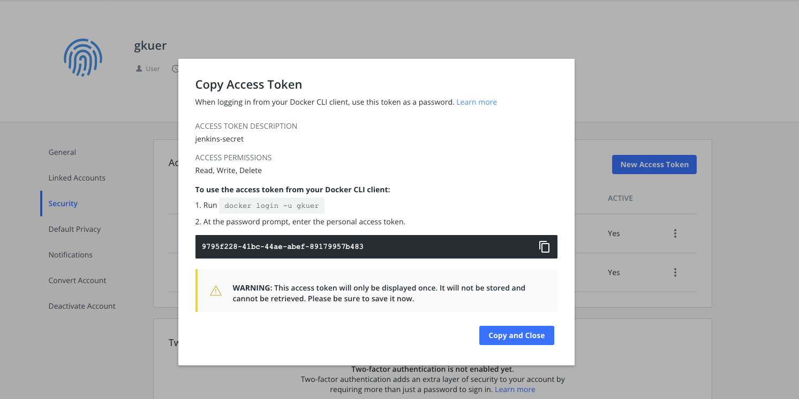Credential 등록

  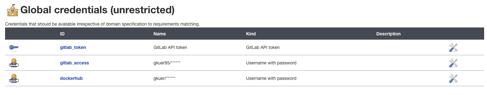

- 파이프라인 구축 (Build Image & to Dcokerhub)

  - Jenkinsfile -  Pipeline 라인 구성

  ```bash
  pipeline{
  
  	agent any
  
  	environment {
  		DOCKERHUB_CREDENTIALS=credentials('dockerhub')
  	}
  
  	stages {
  
  		stage('Build') {
  
  			steps {
  			    dir("./backend/joalarm") {
  			        sh 'chmod +x ./gradlew'
                      sh './gradlew clean build'
                      sh 'docker build --build-arg ENVIRONMENT=dev -t gkuer/joalarm-springboot .'
  			    }
  			}
  		}
  
  		stage('Login') {
  
  			steps {
  				sh 'echo $DOCKERHUB_CREDENTIALS_PSW | docker login -u $DOCKERHUB_CREDENTIALS_USR --password-stdin'
  			}
  		}
  
  		stage('Push') {
  
  			steps {
  				sh 'docker push gkuer/joalarm-springboot'
  			}
  		}
  	}
  
  	post {
  		always {
  			sh 'docker logout'
  		}
  	}
  }
  ```

- Dockerfile 변경

  - app.jar 뒤에 / 추가

  ```docker
  FROM openjdk:11
  EXPOSE 8888
  ARG JAR_FILE=build/libs/*.jar
  COPY ${JAR_FILE} app.jar/
  ENTRYPOINT ["java", "-jar", "/app.jar"]
  ```

- Pipeline script from SCM 구성

  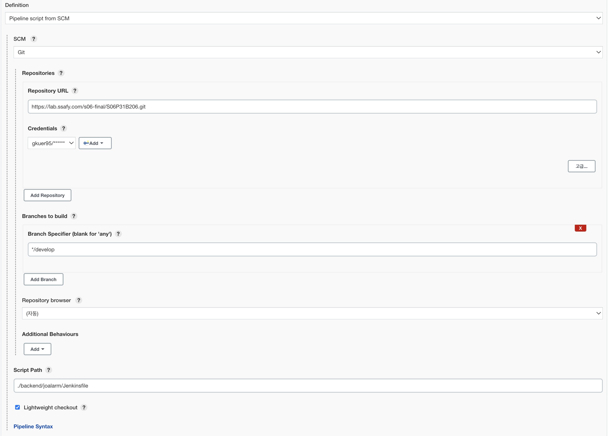

- K8S Deployment

  - imagePullPolicy: Always 설정

  ```yaml
  spec:
        containers:
          - name: springboot
            image: gkuer/joalarm-springboot
            ports:
              - containerPort: 8888
                protocol: TCP
            imagePullPolicy: Always
  ```

- 파이프라인 구축

  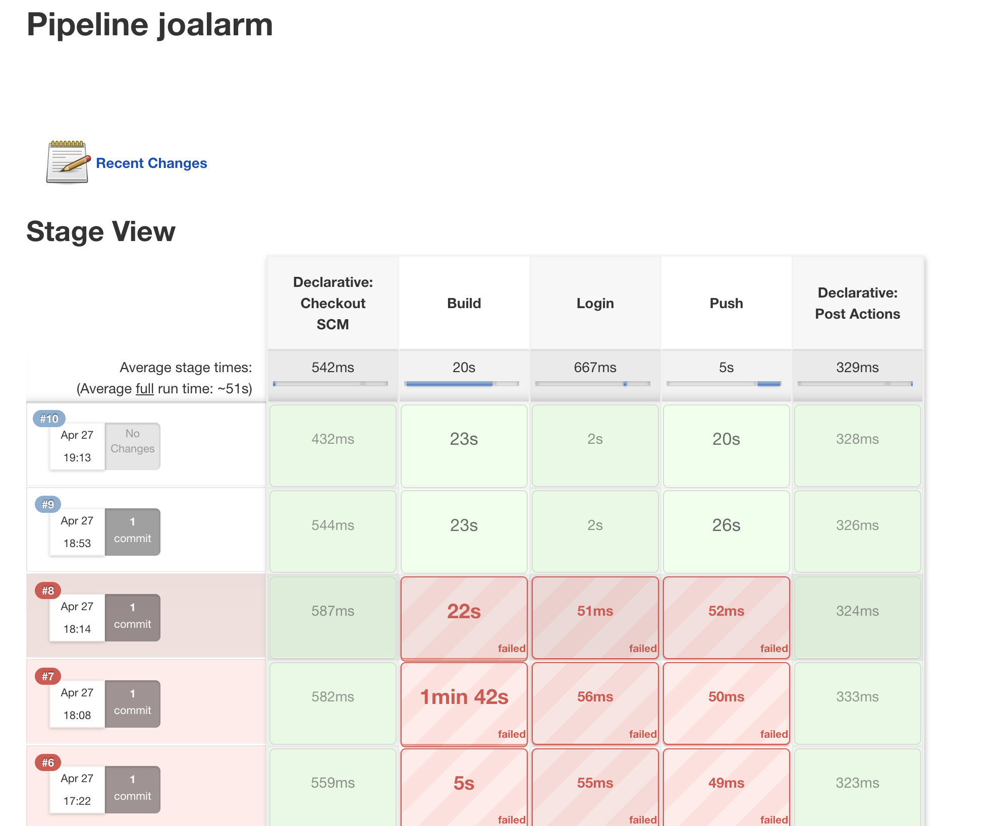


## 6. React

### Docker Image

- nginx.conf 생성

  - /Users/gkuer/Desktop/S06P31B206/frontend/nginx.conf

  ```bash
  server {
      listen 80;
      location / {
          root    /app/build;
          index   index.html;
          try_files $uri $uri/ /index.html;
      }
  }
  ```

- React build

  ```bash
  ~/Desktop/S06P31B206/frontend (develop*) » npm i
  ~/Desktop/S06P31B206/frontend (develop*) » npm run build
  ```

- Dockerfile 생성

  ```bash
  # nginx 이미지를 사용합니다. 뒤에 tag가 없으면 latest 를 사용합니다.
  FROM nginx
  
  # root 에 app 폴더를 생성
  RUN mkdir /app
  
  # work dir 고정
  WORKDIR /app
  
  # work dir 에 build 폴더 생성 /app/build
  RUN mkdir ./build
  
  # host pc의 현재경로의 build 폴더를 workdir 의 build 폴더로 복사
  ADD ./build ./build
  
  # nginx 의 default.conf 를 삭제
  RUN rm /etc/nginx/conf.d/default.conf
  
  # host pc 의 nginx.conf 를 아래 경로에 복사
  COPY ./nginx.conf /etc/nginx/conf.d
  
  # 80 포트 오픈
  EXPOSE 80
  
  # container 실행 시 자동으로 실행할 command. nginx 시작함
  CMD ["nginx", "-g", "daemon off;"]
  ```

- 이미지 빌드

  ```bash
  ~/Desktop/S06P31B206/frontend (develop*) » docker build -t gkuer/joalarm-react:latest .                                                gkuer@Gkuerui-MacBookPro
  [+] Building 2.3s (11/11) FINISHED
   => [internal] load build definition from Dockerfile                                                                                                       0.0s
   => => transferring dockerfile: 37B                                                                                                                        0.0s
   => [internal] load .dockerignore                                                                                                                          0.0s
   => => transferring context: 34B                                                                                                                           0.0s
   => [internal] load metadata for docker.io/library/node:16.14.2                                                                                            2.1s
   => [auth] library/node:pull token for registry-1.docker.io                                                                                                0.0s
   => [1/5] FROM docker.io/library/node:16.14.2@sha256:6e54786b2ad01667d46524e82806298714f50d2be72b39706770aed55faedbd7                                      0.0s
   => [internal] load build context                                                                                                                          0.0s
   => => transferring context: 4.65kB                                                                                                                        0.0s
   => CACHED [2/5] WORKDIR /app                                                                                                                              0.0s
   => CACHED [3/5] COPY package.json /app/package.json                                                                                                       0.0s
   => CACHED [4/5] RUN npm install                                                                                                                           0.0s
   => [5/5] COPY . ./                                                                                                                                        0.0s
   => exporting to image                                                                                                                                     0.1s
   => => exporting layers                                                                                                                                    0.0s
   => => writing image sha256:1372585e89e7c0c066edc3f25a4b696d2ad72fac64dad516d277bc49daedd163                                                               0.0s
   => => naming to docker.io/gkuer/joalarm-react:latest                                                                                                      0.0s
  
  Use 'docker scan' to run Snyk tests against images to find vulnerabilities and learn how to fix them
  ```

- Dockerhub Push

  ```bash
  ~/Desktop/S06P31B206/frontend (develop*) » docker push gkuer/joalarm-react                                                             gkuer@Gkuerui-MacBookPro
  Using default tag: latest
  The push refers to repository [docker.io/gkuer/joalarm-react]
  9b4218f20645: Pushed
  4d2ccb6fe16f: Layer already exists
  fed48c58f14e: Layer already exists
  2f63f4c17307: Layer already exists
  3e4801a3cfe3: Layer already exists
  52101239f8c7: Layer already exists
  e0bd9c8e45b3: Layer already exists
  6fd97e423126: Layer already exists
  ca58f1c44290: Layer already exists
  957a6eed8d1f: Layer already exists
  85fe00380881: Layer already exists
  5d253e59e523: Layer already exists
  b9fd5db9c9a6: Layer already exists
  latest: digest: sha256:51bb4040cec3eb57fc8072b4a4df76ae2bc8bd88a9ca3c70c06516767826bd5e size: 3051
  ```

  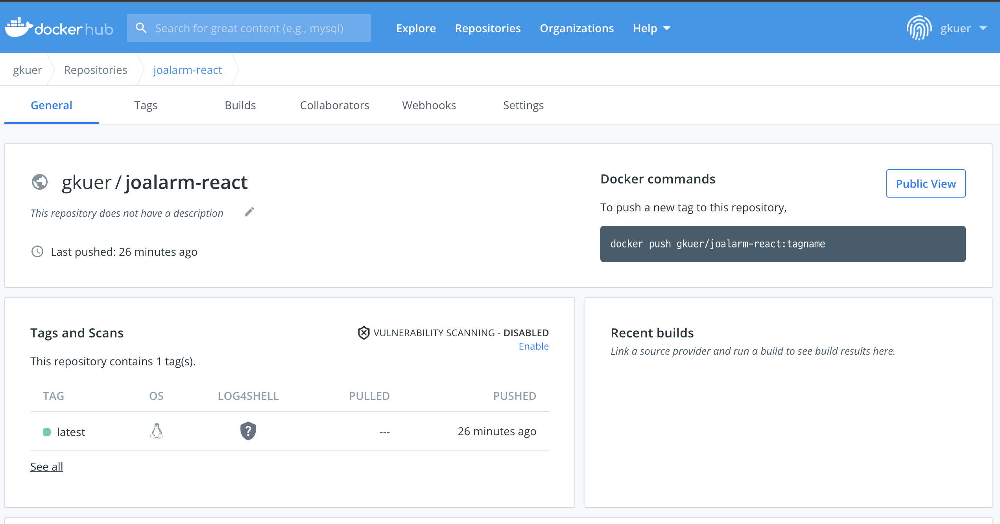

### 쿠버네티스 Deployment - ReplicaSet - Service

- Deployment 생성

  ```bash
  kind: Deployment
  apiVersion: apps/v1
  metadata:
    name: react
  spec:
    replicas: 1
    selector:
      matchLabels:
        app: react
    template:
      metadata:
        labels:
          app: react
      spec:
        containers:
          - name: react
            image: gkuer/joalarm-react
            imagePullPolicy: Always
            ports:
              - containerPort: 80
        restartPolicy: Always
  ```

- Service 생성

  ```bash
  kind: Service
  apiVersion: v1
  metadata:
    name: service-react
  spec:
    type: NodePort
    ports:
      - port: 80
        targetPort: 80
        protocol: TCP
        nodePort: 31000
    selector:
      app: react
  ```

### Jenkins Pipeline 구축

- Pipeline Script

  ```bash
  pipeline{
  
  	agent any
  
  	environment {
  		DOCKERHUB_CREDENTIALS=credentials('dockerhub')
  	}
  
  	stages {
  
  		stage('Build') {
  
  			steps {
  			    dir("./frontend") {
  			        sh 'npm i'
                sh 'CI=false npm run build'
                sh 'docker build -t gkuer/joalarm-react:latest .'
  			    }
  			}
  		}
  
  		stage('Login') {
  
  			steps {
  				sh 'echo $DOCKERHUB_CREDENTIALS_PSW | docker login -u $DOCKERHUB_CREDENTIALS_USR --password-stdin'
  			}
  		}
  
  		stage('Push') {
  
  			steps {
  				sh 'docker push gkuer/joalarm-react'
  			}
  		}
  	}
  
  	post {
  		always {
  			sh 'docker logout'
  		}
  	}
  
  }
  ```

- 파이프라인 구축 (Git ⇒ Jenkins 이미지 빌드 ⇒ Dockerhub)

  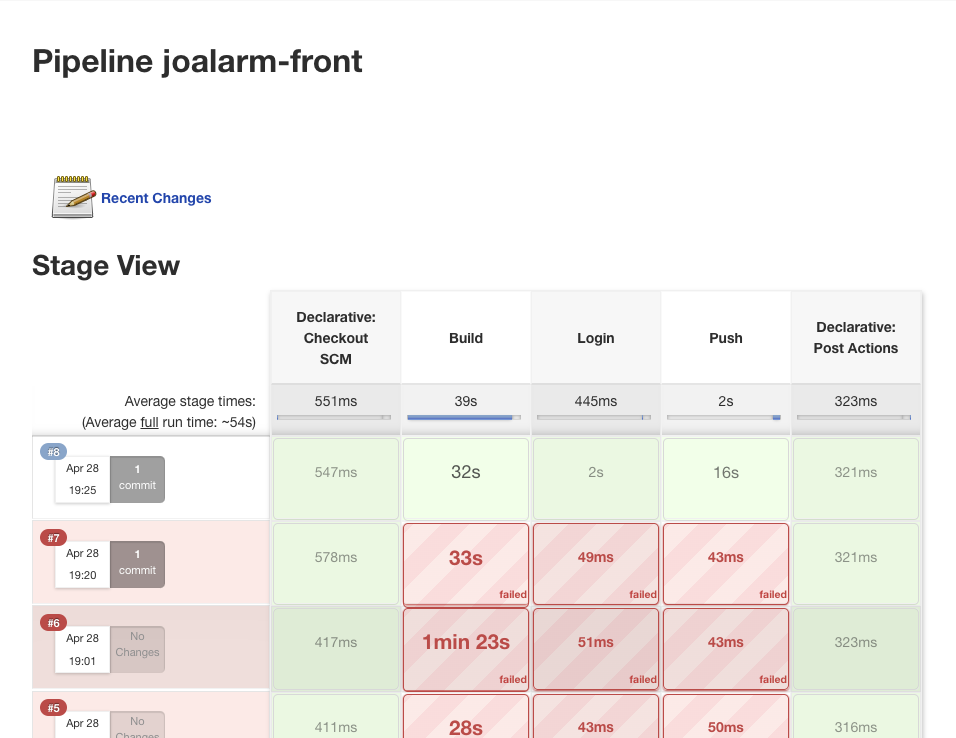

## 7. Ingress-Nginx

- Ingress 사용 이유
  - Service Loadbalancing
    - Front(/~) / Back (/api~)으로 분기
  - 카나리 업데이트
    - 사용 안함
  - https
    - https로만 들어올 수 있게

### Nginx Deployment

- Nginx 설치

  ```bash
  kubectl apply -f https://raw.githubusercontent.com/kubernetes/ingress-nginx/controller-v1.0.0/deploy/static/provider/baremetal/deploy.yaml
  ```

- Ingress

  ```yaml
  apiVersion: networking.k8s.io/v1
  kind: Ingress
  metadata:
    name: ingress-nginx
  spec:
    ingressClassName: nginx
    tls:
    - hosts:
      - www.someone-might-like-you.com
      secretName: someone
    rules:
    - host: www.someone-might-like-you.com
      http:
        paths:
        - path: /
          pathType: Prefix
          backend:
            service:
              name: service-react
              port:
                number: 80
        - path: /api
          pathType: Prefix
          backend:
            service:
              name: service-springboot
              port:
                number: 8888
  ```

- ingress-nginx 팟 상태 확인

  ```bash
  ubuntu@ip-172-26-10-112:/workspace/data/kubernetes/pv/mysql$ kubectl get pod -n ingress-nginx
  NAME                                        READY   STATUS      RESTARTS   AGE
  ingress-nginx-admission-create-nfp8d        0/1     Completed   0          11m
  ingress-nginx-admission-patch-2k77f         0/1     Completed   1          11m
  ingress-nginx-controller-75f58fbf6b-ms2l6   1/1     Running     0          11m
  ```

- 서비스 노드포트 상태 확인

  ```bash
  ubuntu@ip-172-26-10-112:/workspace/data/kubernetes/pv/mysql$ kubectl get svc -n ingress-nginx
  NAME                                 TYPE        CLUSTER-IP       EXTERNAL-IP   PORT(S)                      AGE
  ingress-nginx-controller             NodePort    10.106.85.10     <none>        80:31551/TCP,443:31544/TCP   11m
  ingress-nginx-controller-admission   ClusterIP   10.100.172.224   <none>        443/TCP                      11m
  ```

### HTTPS-Kubernetes 클러스터 적용

- certbot Docker 실행

  ```yaml
  ubuntu@ip-172-26-10-112:~$ docker run -it --rm --name cert_tmp -p 80:80 -v /home/ubuntu/cert:/etc/letsencrypt certbot/certbot certonly \
  > --standalone -d www.someone-might-like-you.com -m gkuer95@gmail.com
  Unable to find image 'certbot/certbot:latest' locally
  latest: Pulling from certbot/certbot
  339de151aab4: Pull complete
  a860e27ad689: Pull complete
  910a9a405b4b: Pull complete
  bde2ad12a253: Pull complete
  c6c8e9f0153d: Pull complete
  d397e2192fef: Pull complete
  3fb10b303714: Pull complete
  aaed35ce1e39: Pull complete
  42fcc09e2708: Pull complete
  382c4f12dd55: Pull complete
  75303e53b8f0: Pull complete
  4159d49c5283: Pull complete
  3bb01cd6d90b: Pull complete
  Digest: sha256:cbe9b78876080e0e7b5bd715c0a3057eb11e9ba34922f68df8252a5e3e986d1a
  Status: Downloaded newer image for certbot/certbot:latest
  Saving debug log to /var/log/letsencrypt/letsencrypt.log
  ```

- sudo로 root 계정으로 전환

  ```yaml
  sudo -i
  ```

- cp

  ```yaml
  cp /home/ubuntu/cert/live ~~/*.pem /home/ubuntu/
  ```

- 권한주기

  ```yaml
  sudo chown ubuntu:ubuntu *.pem
  ```

- tls 다운로드

  ```bash
  ubuntu@ip-172-26-10-112:/workspace/ssl$ sudo openssl req -x509 -nodes -days 365 -newkey rsa:2048 -keyout tls.key -out tls.crt -subj "/CN=www.someone-might-like-you.com/O=www.someone-might-like-you.com"
  Generating a RSA private key
  .....................................+++++
  .....................+++++
  writing new private key to 'tls.key'
  -----
  ```

- 권한 변경

  ```bash
  sudo -i
  ```

- ubuntu로 복사

  ```bash
  root@ip-172-26-10-112: copy *.pem /home/ubuntu
  ```

- tls 시크릿 지정

  ```bash
  kubectl create secret tls someone --key privkey.pem --cert cert.pem
  ```

  - ⇒ 수정, 안드로이드에서 cert.pem을 인식하지 못함 ⇒ fullchain.pem으로 수정

    ```bash
    kubectl create secret tls someone2 --key privkey.pem --cert fullchain.pem
    ```

### Nodeport → LoadBalancer - 외부 Well-known 포트로 변경

- Ingress-nginx service 타입 변경

  ```yaml
  ...
  ,"type":"LoadBalancer"}}
  ...
  spec:
    type: LoadBalancer
  ...
  ```

- externalIps 설정 - 내부 IP(Master node)

  ```yaml
  externalIPs:
      - 172.26.10.112
  ```

- 엔드포인트 추가 확인

  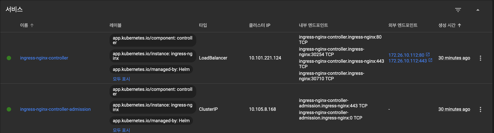

- External Ip 적용 확인

  ```bash
  ubuntu@ip-172-26-10-112:~$ kubectl get svc -n ingress-nginx
  NAME                                 TYPE           CLUSTER-IP       EXTERNAL-IP     PORT(S)                      AGE
  ingress-nginx-controller             LoadBalancer   10.101.221.124   172.26.10.112   80:30254/TCP,443:30710/TCP   30m
  ingress-nginx-controller-admission   ClusterIP      10.105.8.168     <none>          443/TCP                      30m
  ```

- HTTPS + 443포트 접속 확인

  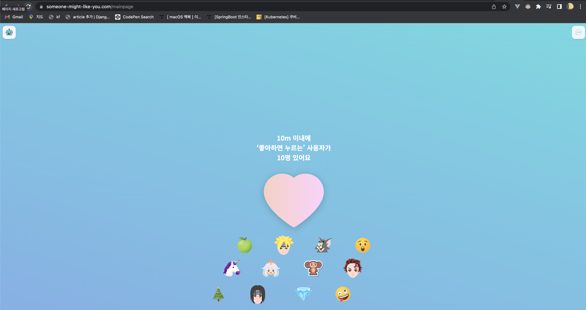


## 7. Jenkins-K8S 연동

### Jenkins 플러그인 설치

- Kubernetes Continuous Deploy 플러그인 설치
  - 현재 버전은 사용 불가
  - 1.0.0 버전 다운로드 후 직접 업로드 해서 사용
    - [https://velog.io/@seokbin/Jenkins-Kubernetes-배포-with-Nexus](https://velog.io/@seokbin/Jenkins-Kubernetes-%EB%B0%B0%ED%8F%AC-with-Nexus) 참조
- Kubernetes Credentials 플러그인 설치

### Kubernetes-Credential in Jenkins 등록

- Global Credential로 관리

  - Kubeconfig - Enter directly로 설정

  - 값 가져오기

    - 마스터노드 /home/ubuntu/.kube로 진입 후 내용 확인

    ```yaml
    ubuntu@ip-172-26-10-112:~/.kube$ cat config
    apiVersion: v1
    clusters:
    - cluster:
        certificate-authority-data: {SECRET}
        server: https://172.26.10.112:6443
      name: kubernetes
    contexts:
    - context:
        cluster: kubernetes
        user: kubernetes-admin
      name: kubernetes-admin@kubernetes
    current-context: kubernetes-admin@kubernetes
    kind: Config
    preferences: {}
    users:
    - name: kubernetes-admin
      user:
        client-certificate-data: {SECRET}
        client-key-data: {SECRET}
    ```

  - Credential 설정

    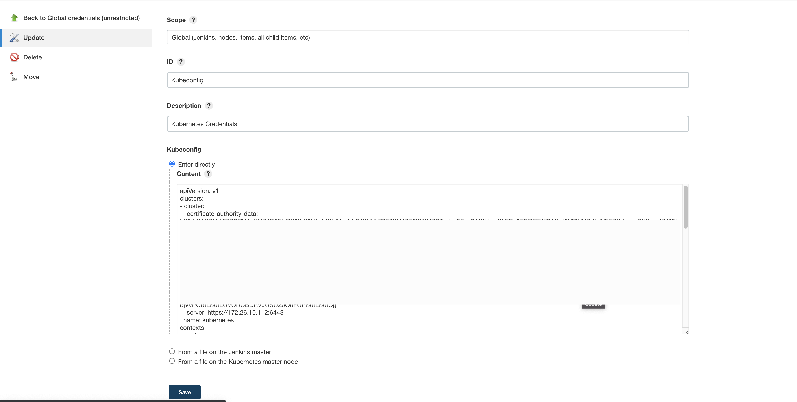

### 파이프라인에 추가

- Springboot - Deployment-Service 내용 생성

  ```yaml
  apiVersion: apps/v1
  kind: Deployment
  metadata:
    name: springboot
    labels:
      app: springboot
  spec:
    replicas: 6
    selector:
      matchLabels:
        app: springboot
    template:
      metadata:
        labels:
          app: springboot
      spec:
        containers:
          - name: springboot
            image: gkuer/joalarm-springboot:latest
            ports:
              - containerPort: 8888
            imagePullPolicy: Always
            env:
              - name: MYSQL_CLUSTER_IP
                valueFrom:
                  configMapKeyRef:
                    name: joalarm-springboot-config
                    key: mysql-cluster-ip
              - name: MONGO_CLUSTER_IP
                valueFrom:
                  configMapKeyRef:
                    name: joalarm-springboot-config
                    key: mongo-cluster-ip
              - name: S3_BUCKET_NAME
                valueFrom:
                  configMapKeyRef:
                    name: joalarm-s3-config
                    key: s3-bucket-name
              - name: USERNAME
                valueFrom:
                  secretKeyRef:
                    name: joalarm-springboot-secret
                    key: username
              - name: PASSWORD
                valueFrom:
                  secretKeyRef:
                    name: joalarm-springboot-secret
                    key: password
              - name: AWS_ACCESS_KEY
                valueFrom:
                  secretKeyRef:
                    name: joalarm-s3-secret
                    key: aws-access-key
              - name: AWS_SECRET_KEY
                valueFrom:
                  secretKeyRef:
                    name: joalarm-s3-secret
                    key: aws-secret-key
              - name: JWT_SECRET_KEY
                valueFrom:
                  secretKeyRef:
                    name: joalarm-jwt-secret
                    key: jwt-secret-key
        restartPolicy: Always
  ---
  
  apiVersion: v1
  kind: Service
  metadata:
    name: service-springboot
  spec:
    selector:
      app: springboot
    ports:
      - protocol: TCP
        port: 8888
        targetPort: 8888
    type: LoadBalancer
  ```

- Springboot - Jenkinsfile에 스테이지 추가 생성

  ```yaml
  stage('K8S Deploy') {
  
              steps {
                  dir("./backend/joalarm") {
                      script {
                          kubernetesDeploy(configs: "joalarm-auto-deploy-springboot.yaml", kubeconfigId: 'Kubeconfig')
                          sh './kubectl --kubeconfig=./kube-config.yaml rollout restart deployment springboot'
                      }
                  }
              }
          }
  ```

- React - Deployment-Service 내용 생성

  ```yaml
  kind: Deployment
  apiVersion: apps/v1
  metadata:
    name: react
  spec:
    replicas: 3
    selector:
      matchLabels:
        app: react
    template:
      metadata:
        labels:
          app: react
      spec:
        containers:
          - name: react
            image: gkuer/joalarm-react:latest
            ports:
              - containerPort: 80
            imagePullPolicy: Always
        restartPolicy: Always
  
  ---
  kind: Service
  apiVersion: v1
  metadata:
    name: service-react
  spec:
    type: NodePort
    ports:
      - port: 80
        targetPort: 80
        protocol: TCP
        nodePort: 31000
    selector:
      app: react
  ```

- React - Jenkinsfile에 스테이지 추가 생성

  ```yaml
  stage('K8S Deploy') {
  
              steps {
                  dir("./frontend") {
                      script {
                          kubernetesDeploy(configs: "joalarm-auto-deploy-react.yaml", kubeconfigId: 'Kubeconfig')
  						sh './kubectl --kubeconfig=./kube-config.yaml rollout restart deployment react'
                      }
                  }
              }
          }
  ```

- 파이프라인 구성 완료


## 8. Rollout Restart 추가

- 해당 yaml 파일로 Deployment가 수정되었지만 Deployment의 Rollout Restart 필요

### Springboot Deployment

- 경로에 맞춰 kubectl 설치

  ```bash
  jenkins@2c12ec6a7d66:~/workspace/joalarm/backend/joalarm$ curl -LO "https://storage.googleapis.com/kubernetes-release/release/v1.20.5/bin/linux/amd64/kubectl"
    % Total    % Received % Xferd  Average Speed   Time    Time     Time  Current
                                   Dload  Upload   Total   Spent    Left  Speed
  100 38.3M  100 38.3M    0     0  25.0M      0  0:00:01  0:00:01 --:--:-- 25.0M
  ```

- 권한 변경

  ```bash
  jenkins@2c12ec6a7d66:~/workspace/joalarm/backend/joalarm$ chmod u+x ./kubectl
  ```

- kube-config.yaml 작성

  - 위의 master node에서 가져오는 법과 동일

  ```bash
  jenkins@2c12ec6a7d66:~/workspace/joalarm/backend/joalarm$ vi kube-config.yaml
  ```

  ```bash
  apiVersion: v1
  clusters:
  - cluster:
      certificate-authority-data: {SECRET}
      server: https://172.26.10.112:6443
    name: kubernetes
  contexts:
  - context:
      cluster: kubernetes
      user: kubernetes-admin
    name: kubernetes-admin@kubernetes
  current-context: kubernetes-admin@kubernetes
  kind: Config
  preferences: {}
  users:
  - name: kubernetes-admin
    user:
      client-certificate-data: {SECRET}
      client-key-data: {SECRET}
  ```

- 명령어 시도

  ```bash
  jenkins@2c12ec6a7d66:~/workspace/joalarm/backend/joalarm$ ./kubectl --kubeconfig=./kube-config.yaml get deployments
  NAME         READY   UP-TO-DATE   AVAILABLE   AGE
  mongo        1/1     1            1           7d12h
  mysql        1/1     1            1           7d22h
  ```

- Jenkinsfile (Pipeline)에 쉘 명령으로 추가

  ```bash
  stage('K8S Deploy') {
  
              steps {
                  dir("./backend/joalarm") {
                      script {
                          kubernetesDeploy(configs: "joalarm-auto-deploy-springboot.yaml", kubeconfigId: 'Kubeconfig')
                          sh './kubectl --kubeconfig=./kube-config.yaml rollout restart deployment springboot'
                      }
                  }
              }
          }
  ```

### React Deployment

- 경로에 맞춰 kubectl 설치

  ```bash
  jenkins@2c12ec6a7d66:~/workspace/joalarm-front/frontend$ curl -LO "https://storage.googleapis.com/kubernetes-release/release/v1.20.5/bin/linux/amd64/kubectl"
    % Total    % Received % Xferd  Average Speed   Time    Time     Time  Current
                                   Dload  Upload   Total   Spent    Left  Speed
  100 38.3M  100 38.3M    0     0  25.0M      0  0:00:01  0:00:01 --:--:-- 25.0M
  ```

- 권한 변경

  ```bash
  jenkins@2c12ec6a7d66:~/workspace/joalarm-front/frontend$ chmod u+x ./kubectl
  ```

- kube-config.yaml 작성

  - 위의 master node에서 가져오는 법과 동일

  ```bash
  jenkins@2c12ec6a7d66:~/workspace/joalarm-front/frontend$ vi kube-config.yaml
  ```

  ```bash
  apiVersion: v1
  clusters:
  - cluster:
      certificate-authority-data: {SECRET}
      server: https://172.26.10.112:6443
    name: kubernetes
  contexts:
  - context:
      cluster: kubernetes
      user: kubernetes-admin
    name: kubernetes-admin@kubernetes
  current-context: kubernetes-admin@kubernetes
  kind: Config
  preferences: {}
  users:
  - name: kubernetes-admin
    user:
      client-certificate-data: {SECRET}
      client-key-data: {SECRET}
  ```

- 명령어 시도

  ```bash
  jenkins@2c12ec6a7d66:~/workspace/joalarm-front/frontend$ ./kubectl --kubeconfig=./kube-config.yaml rollout restart deployment react
  deployment.apps/react restarted
  ```

- Jenkinsfile (Pipeline)에 쉘 명령으로 추가

  ```bash
  stage('K8S Deploy') {
  
              steps {
                  dir("./backend/joalarm") {
                      script {
                          kubernetesDeploy(configs: "joalarm-auto-deploy-springboot.yaml", kubeconfigId: 'Kubeconfig')
                          sh './kubectl --kubeconfig=./kube-config.yaml rollout restart deployment react'
                      }
                  }
              }
          }
  ```

- 지속적 배포 확인

  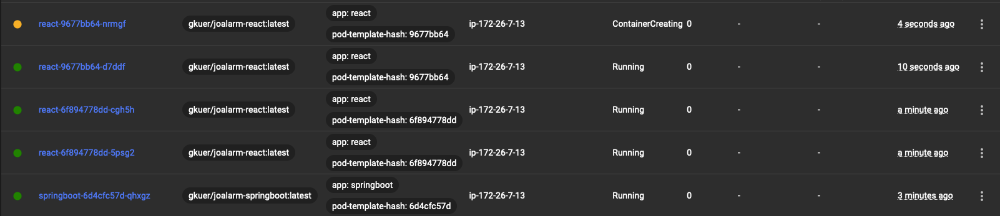

## 9. 팀 내의 빌드 상태 및 로그 확인을 위한 Mattermost-Jenkins 연동

### Mattermost 설정

- Mattermost ⇒ Intergration ⇒ Incoming Webhook ⇒ 설정

  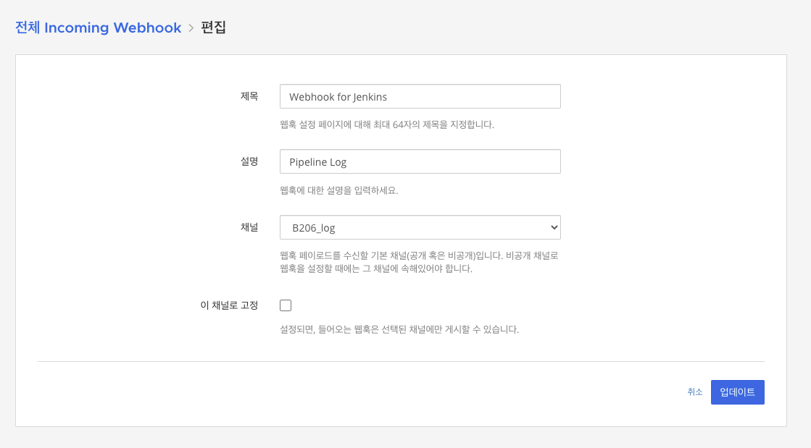

  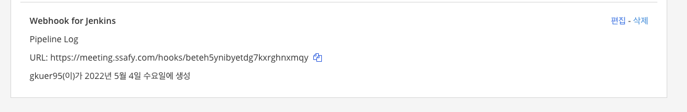

- 해당 URL 복사

### Jenkins 설정

- 플러그인 및 초기 셋팅

  - [https://mattermost.com/blog/getting-started-with-mattermost-integrations/](https://mattermost.com/blog/getting-started-with-mattermost-integrations/) 참조

- 파이프라인 구성

  ```yaml
  pipeline{
  
  	agent any
  
  	environment {
  		DOCKERHUB_CREDENTIALS=credentials('dockerhub')
  	}
  
  	stages {
  
  		stage('Build') {
  
  			steps {
  			    dir("./backend/joalarm") {
  			        script {
  			            mattermostSend(color: "#FFFF8C", message: "Jenkins - ${env.BUILD_NUMBER}번째 Backend 도커 이미지 빌드 시작")
  			            try {
                              sh 'chmod +x ./gradlew'
                              sh './gradlew clean build'
                              sh 'docker build --build-arg ENVIRONMENT=dev -t gkuer/joalarm-springboot .'
                              mattermostSend(color: "#FF33FF", message: "Jenkins - ${env.BUILD_NUMBER}번째 Backend 도커 이미지 빌드 완료")
                          } catch(e) {
                              mattermostSend(color: "#FF33FF", message: "Jenkins - ${env.BUILD_NUMBER}번째 Backend 도커 이미지 빌드 실패 => 로그 확인 : ${env.BUILD_URL}")
                          }
                      }
  			    }
  			}
  		}
  
  		stage('Login') {
  
  			steps {
  				sh 'echo $DOCKERHUB_CREDENTIALS_PSW | docker login -u $DOCKERHUB_CREDENTIALS_USR --password-stdin'
  			}
  		}
  
  		stage('Push') {
  
  			steps {
  				sh 'docker push gkuer/joalarm-springboot'
  				mattermostSend(color: "#33FFCC", message: "Dockerhub - ${env.BUILD_NUMBER}번째 Backend 푸쉬 완료")
  			}
  		}
  
          stage('K8S Deploy') {
  
              steps {
                  dir("./backend/joalarm") {
                      script {
                          kubernetesDeploy(configs: "joalarm-auto-deploy-springboot.yaml", kubeconfigId: 'Kubeconfig')
                          sh './kubectl --kubeconfig=./kube-config.yaml rollout restart deployment springboot'
                          mattermostSend(color: "#0066CC", message: "Kubernetes - ${env.BUILD_NUMBER}번째 Backend 배포 완료")
                      }
                  }
              }
          }
  	}
  
  	post {
  		always {
  			sh 'docker logout'
  		}
  	}
  
  }
  ```

- 로그 확인

  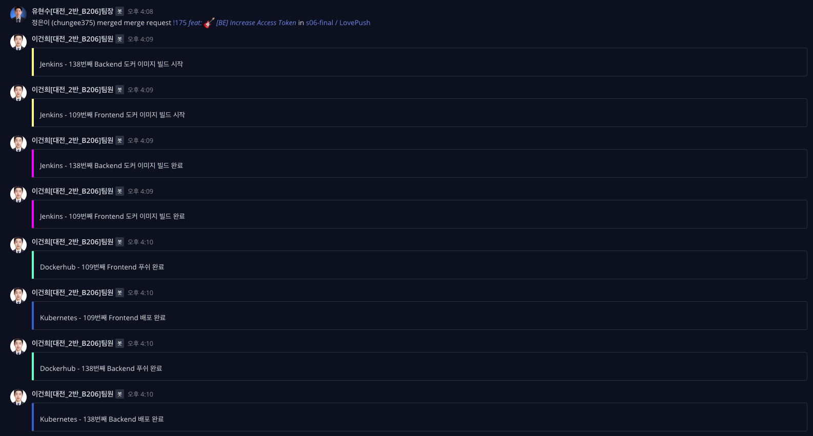
